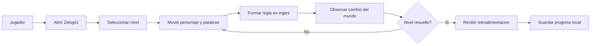

# Casos de uso

```mermaid
flowchart LR
  J[Jugador] --> A[Abrir ZelogiG]
  A --> S[Seleccionar nivel]
  S --> M[Mover personaje y palabras]
  M --> R[Formar regla en ingles]
  R --> C[Observar cambio del mundo]
  C --> V{Nivel resuelto?}
  V -- No --> M
  V -- Si --> F[Recibir retroalimentacion]
  F --> P[Guardar progreso local]
```
