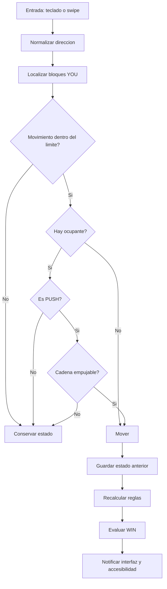

# Flujo del motor

```mermaid
flowchart TD
  I[Entrada: teclado o swipe] --> D[Normalizar direccion]
  D --> Y[Localizar bloques YOU]
  Y --> L{Movimiento dentro del limite?}
  L -- No --> X[Conservar estado]
  L -- Si --> O{Hay ocupante?}
  O -- No --> M[Mover]
  O -- Si --> Q{Es PUSH?}
  Q -- No --> X
  Q -- Si --> E{Cadena empujable?}
  E -- No --> X
  E -- Si --> M
  M --> H[Guardar estado anterior]
  H --> R[Recalcular reglas]
  R --> W[Evaluar WIN]
  W --> N[Notificar interfaz y accesibilidad]
```
