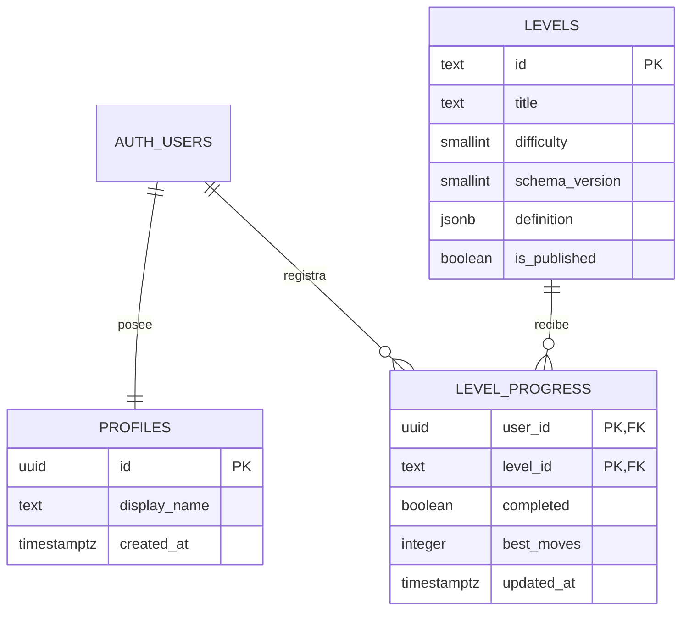

# Modelo entidad-relacion

```mermaid
erDiagram
  AUTH_USERS ||--|| PROFILES : posee
  AUTH_USERS ||--o{ LEVEL_PROGRESS : registra
  LEVELS ||--o{ LEVEL_PROGRESS : recibe

  PROFILES {
    uuid id PK
    text display_name
    timestamptz created_at
  }
  LEVELS {
    text id PK
    text title
    smallint difficulty
    smallint schema_version
    jsonb definition
    boolean is_published
  }
  LEVEL_PROGRESS {
    uuid user_id PK,FK
    text level_id PK,FK
    boolean completed
    integer best_moves
    timestamptz updated_at
  }
```
