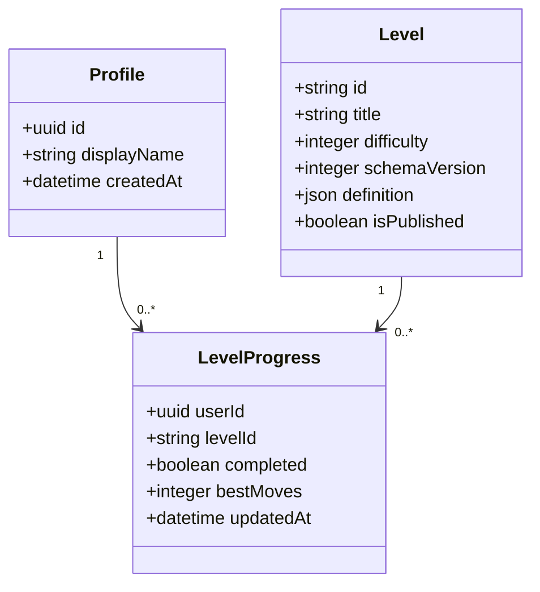

# Modelo logico

```mermaid
classDiagram
  class Profile {
    +uuid id
    +string displayName
    +datetime createdAt
  }
  class Level {
    +string id
    +string title
    +integer difficulty
    +integer schemaVersion
    +json definition
    +boolean isPublished
  }
  class LevelProgress {
    +uuid userId
    +string levelId
    +boolean completed
    +integer bestMoves
    +datetime updatedAt
  }
  Profile "1" --> "0..*" LevelProgress
  Level "1" --> "0..*" LevelProgress
```
