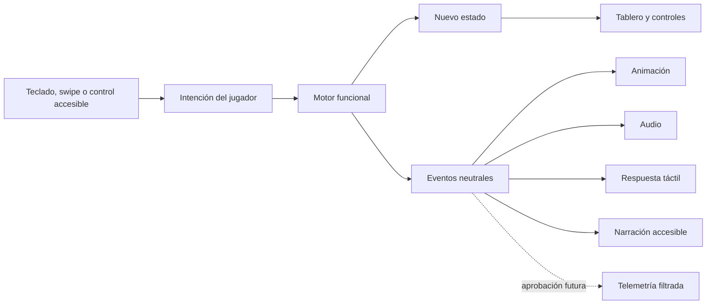

# Sistema de experiencia

```mermaid
flowchart LR
  I[Teclado, swipe o control accesible] --> A[Intención del jugador]
  A --> M[Motor funcional]
  M --> S[Nuevo estado]
  M --> E[Eventos neutrales]
  S --> UI[Tablero y controles]
  E --> AN[Animación]
  E --> AU[Audio]
  E --> HP[Respuesta táctil]
  E --> AX[Narración accesible]
  E -. aprobación futura .-> TM[Telemetría filtrada]
```
